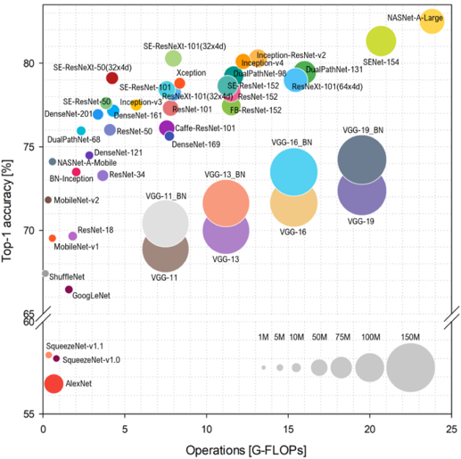
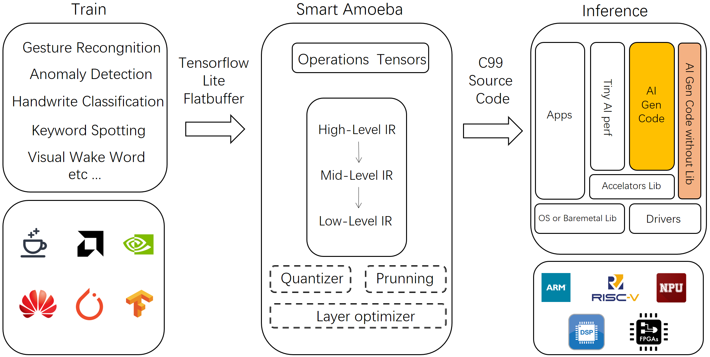
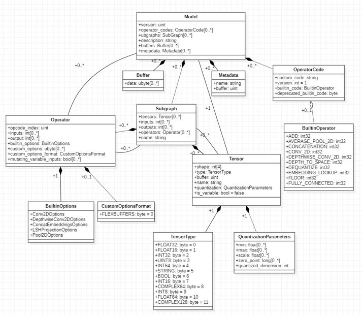
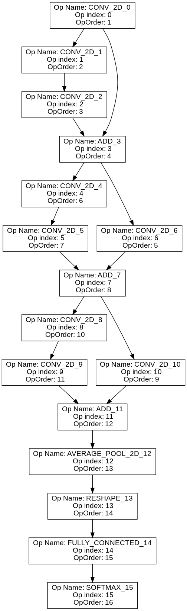
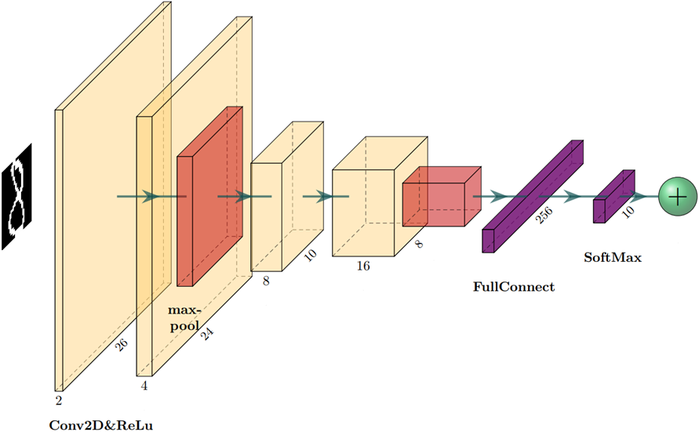
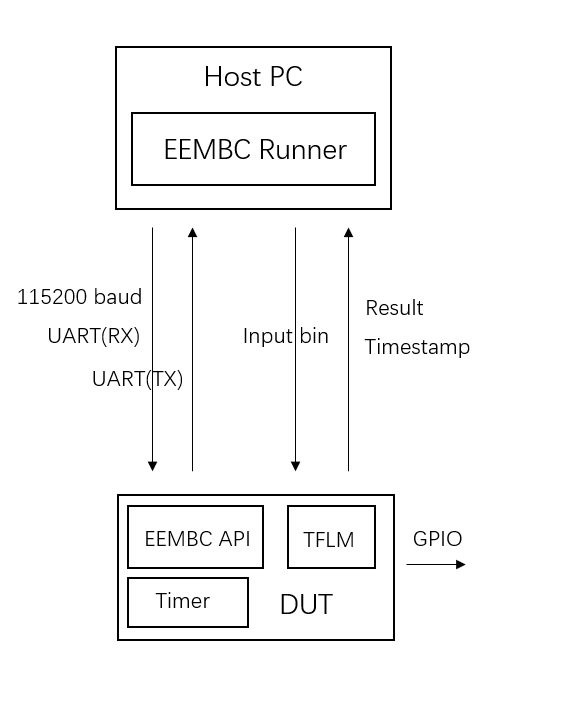

# Smart Amoeba

EN|[简中](Readme_CN.md)

A tinyML inference stack.

This document also contain a general introduction and overview of tinyML.

The name is explained [here](doc/nameIDEA.md).

<!-- Written in 3 am midnight. Please don't be harsh alright? -->
<!-- TODO @ninn55 Check for spelling error and grammar error! -->
<!-- TODO @ninn55 Check for Cpa inconsistency! -->

## Introduction

Moving AI (artificial intelligence) to embedded application can post certain challenges. Compared to cloud and mobile computing, the ecosystem for embedded hardware can be fragmented. System can vary from software to hardware stack, from build system to compiler, from ISA to peripherals. Embedded device at its core, is a highly customized computer system aiming at wide range of applications, which caused the highly customized software and hardware design. OS(Operating system) ranging from bare-metal to RTOS(Real time operating system), to micro-kernel, to Linux, is developed to fit onto different hardware. Power consumption can vary from micro-watts to hundreds of watts to accommodate from sensory analysis to self-driving cars and drones. A typical embedded system has certain traits:

<!-- TODO @BaconXu Changed mandarin content please verify-->

* Limited computing resources: AI/ML algorithm usually takes more computation. Running a programs needs CPU(Central Computing Unit) time and RAM(Randomly Accessed Memory). In terms, they are determined by limited power. This will cause significant challenges, when porting AI algorithm to edge. As shown in table below, with Cloud Mobile and Tiny compared, the computing power difference can be clearly seen.

* Fragmented ecosystem: The capacity of memory can range from KiloBytes to MegaBytes, from SRAM to SDRAM to DRAM. The Coremark:tm: score ranging from couple dozen to thousands. SIMD and float point operation is also limited to specific hardware platform. HAL(hardware abstraction layer) can also be different to fit application scenarios.

* Lack of Wildly accepted benchmarking: processors from different hardware vender have different debugging interface, simple OS or bare-metal. Code for user application and OS is usually mixed together. Along side with the lack of file system and shell interface makes it harder to run benchmark on a single application.

* Lack of portability: Software stack for commercial use is always business logic oriented. Portability is sacrificed for speed and space.

AI as a broad term means machine showing human intelligence. Recently, the most straight forward way is through neural network. But the NN itself is usually unexplainable and needed to be trained or verified on a large dataset. Designing an algorithm for embedded hardware can be especially challenging:

* Lack of mature use cases: Academically and commercially speaking most advances in deep learning is for cloud for mobile platform.
* Lack of open dataset: Most open source dataset as of 2021 is designed for cloud uses.
* Lack of mature model architecture: There is no widely accepted model architecture for embedded devices. Most mature NN archetecture is designed for cloud computing and can need up to 25 G-FLOPS per inference. As show in figure below, image cropped from MLPerf:tm:.
* Lack of efficient and portable model format: Currently the most used model format for TinyML is ONNX and tflite. But either of them is designed specifically for embedded device. ONNX is designed to be a common format between training framework. TfLite is designed to be run on mobile devices. ONNX is complex and hard to cover all operations in implementation. Decoding tflite model needs significant computing power.

The definition of TinyML given by tinyML organization is

> Tiny machine learning is broadly defined as a fast growing field of machine learning technologies and applications including hardware, algorithms and software capable of performing on-device sensor data analytics at extremely low power, typically in the mW range and below, and hence enabling a variety of always-on use-cases and targeting battery operated devices.

To the best of our knowledge, the definition of TinyML can be quantified as:

<!-- TODO @BaconXu please verify-->

* Always-on power consumption: < 1 mW
* RAM needed: < 100 KB
* ROM needed: < 1 MB
* Operation Count: < 10 MMAC / Inf
* Latency: < 100 mS / Inf

Designing a TinyML application will face challenge from all front. On one hand, AI algorithms take huge computing power. On another hand, embedded ecosystem is fragmented and embedded devices have limited computing power.

* Due to supply issue or advancing technology, the processor baring the TinyML workload need to be change regularly. When that inevitably happens, the inference solution needs to be ported as well.

* A necessary tool is needed to easy the process of deploying model from training framework. And make this process automated.

* When optimizing framework for 

With all that said, the maturity of TinyML can bring certain benefit to commercial industrial and consumer product alike. Including

* More User Privacy: Most end point user cares about privacy more and more and donot want to share personal data with third party cloud solution provider. By processing sensory data locally on edge, customer perceived value can be greatly improved.

* Less Cost on Cloud Computing: When performing on cloud, with the growth of edge node count, companies can easily burn tens of thousands of dollars. By performing inference on edge near sensor, the unreliability and high cost for PaaS or IaaS platform can be reduced.

* More Reliability: Christmas Eve of 2012, AWS failure caused Netflix downtime. End of 2020, google cloud failure caused some essential google service down. Cloud computing is not as reliable as it claims. By performing inference on edge, you can easily maintain the edge node and reduce down time.

* Less Latency: By directly analyse censer data on edge, with enough optimized hardware software and algorithm, latency can be reduced, further improve customer perceived value.

### TinyML Inference Solution

#### Tensorflow Lite Micro

<!-- TODO @BaconXu @ninn55 add later-->
TBD

#### MicroTVM

<!-- TODO @BaconXu @ninn55 add later-->
TBD

#### GLOW

<!-- TODO @BaconXu @ninn55 add later-->
TBD

#### Tengine

<!-- TODO @BaconXu @ninn55 add later-->
TBD

## Our Solution

During our design process, we considered some essential questions and how to solve them:

* Provide a portable and flexible platform that can be easily ported and automatically deployed.
* Minimize dependance on peripherals and hardware requirements.
* Make it easy for hardware developers to optimize the operation bottle neck.
* Support for wide rage of AI ecosystem, including support for operations and model format with training framework, make it easy to deploy and materialize.
* Support for popular quantization scheme and network compression methods. Bring minimum accuracy deduction. Lower Operation count per inference and reduce latency.

With solving thees issues in mind, we made the top level design for SA. SA took model files in tflite format. Then parse and compile into a IR(intermediate representation). Then going through two layers of optimization, algorithm optimization which is hardware independent and hardware-specific optimization. The final target is a compute graph generated entirely in C, and compatible with C99 standard.

To minimized the destabilizing effect of fragmented memory heap space, system provides a First-Fit algorithm. During compile time, a emulated process is employed to determine needed memory size. Then allocate the "playground" with a statically allocated array, since for portability we assume dynamic allocation is not supported. During runtime, SA uses First-Fit to automatically allocate space in the "playground". Although First-Fit can produce memory fragment, but after a inference loop all fragment is recalled.

SA is separated into two part frontend and backend. The frontend is mostly written in Python3. Frontend contains model interface, currently only support tflite model in flatbuffer format, since TFLM is right now the de facto of tinyML inference framework. As an interface to training framework, we uses `flatc` to compile the schema file provided by TensorFlow Lite into python interface to parse the model. As long as the model is in tflite format, it can be trained with TensorFlow or Keras and only uses supported operations, SA can parse the model. The below graph is a visualized class diagram for tflite model in flatbuffer format.

The Frontend also include a dummy First-Fit runner to determine the heap size. there are two kinds of classes in the Front end, converter and IR. IR uses information present in its own layer to generate some outside representation, such as C file as graph or a dot graph for visualization. Each IR only serve one purpose, such as compute the topology order for DAG(Directed Acyclic Graph)  or generate the dot graph. There is one IR is unified and has the most information, All other IR is converted from this unified IR with a specific Converter. Some Converter is integrated into the class constructor for simplicity. Converter as name said take information from one source IR and populate information to another destination IR. 

Below graph is a simplified dot graph for Resnet-10. The model is the image classification model for MLPerf:tm: Tiny closed division.

The backend is the actual implementation of operators and heap algorithm. The standard document for  operator and graph interface and heap allocation will be added soon.

## Benchmark Result

Here, we present 2 benchmark result. One is a image classification task, and direct comparison of the same neural network between TFLM(TensorFlow Lite Micro) and SA. The other is a full fledged benchmark suit.

### Latency Comparison

We designed a simple network with all essential operations, including 2D convelution, 2D Max pooling, ReLu activation, Full Connect and softmax. The full network can be seen in the below graph.

The network input is a 28x28 image from MNIST and the output is a one-hot encoded vector. On a RISC-V MCU implementing RV32 IMACF, compiled with GCC 8.3.0, optimization level 2 and running at 300MHz, the direct comparison of space and speed between TFLM and SA can be seen in table below.

|   | Data Size in KB | Code Size in KB | Latency in mS  |
|---|---|---|---|
| TFLM  | 130.3  |  296.3 | 14.6  |
| SA  | 19.1  | 20.1  |  7.0 |

Compared to TFLM, RAM usage is reduced by 93.2%. ROM usage is reduced by 86.2%. Latency is reduced by 52.1%.

On the same hardware, same compiler option, same network architecture, by simply changing from TFLM to SA, can reduce space and increase speed. On the same hardware, by using SA instead of TFLM, a more powerful network can be implemented, would otherwise running out of memory or bring too long of an elapse time.

### MLPerf:tm: Tiny Inference

MLPerf:tm: Tiny is developed and published by MLCommons with help from community members.

> We (MLCommons) present MLPerf Tiny, the first industry-standard benchmark suite for ultra-low-power tiny machine learning systems.

With the recent advancement in TinyML technology, and the wildly fragmented ecosystem for embedded, a widely accepted benchmark suit is needed to quantify chip's AI compute capability, heterogeneous or otherwise. MLPerf:tm: Tiny is the first published benchmark suit specifically designed for TinyML. For the first round of MLPerf:tm: Tiny, there are four submitters, and they all use different hardwares to bare the load, a RISC-V micro-controller, an ASIC, a Cortex-A ARM processor, a FPGA, and the reference system is a Cortex-M micro-controller. This first submission perfectly demonstrated the fragmentation of embedded ecosystem and the challenge presented when designing a benchmark suit specifically for TinyML.

As a **proof of concept**, our team participated in this round of MLPerf Tiny where we demonstrated the AI compute capability and potential applications in AI for RISC-V micro-controllers.

As a **submitter** and **reviewer**, we closely collaborated with parties involved including Harvard and EEMBC submit a RISC-V MCU entry. During this submission, we used a custom designed silicon solution implementing RV32I MAC instruction set with FPU to support single precision float point arithmetic. This SoC is designed by PCL and fabricated by SMIC (Semiconductor Manufacturing International Corporation) 55nm process and can operate with more than 300MHz clock speed. With 2MB SRAM and a plethora of interfaces, including SPI I2C UART GPIO and CAN bus.

There are four test cases in the test suit, covering most well established use cases for TinyML as of 2021, image classification, audio wake words, visual wake words, and anomaly detection. Anomaly detection uses deep auto-encoder to detect anomalies in audio. The neural network essentially took FFT encoded audio spectrum and out put another spectrum. By comparing the distance between the input and output, the ability of the network to encode and decode the input audio is quantified. Since the auto-encoder is trained only on normal audio data from a toy car, if the distance from input and output is larger than a given threshold, the neural network lack the ability to encode-decode the given audio spectrum. Then we assume the audio is from a abnormal toy car. The task image classification using the classic ResNet structure. By using the residual block to ease the training process. ResNet is a more de facto neural network structure for image classification task. The keyword spotting(audio wake word) and visual wake word both use DS-CNN network architecture, which uses a mobile net inspired network block. Audio wake word recognize specific keyword in a stream of audio data by classifying input spectrum and output an one hot encoded vector. And visual wake word took a preprocessed image and output one hot vector denoting person or not-a-person.

On the test suit side, a closed sourced benchmark runner is running on the host machine to generate a comparable and fare result for every submitter. The runner communicate with host machine with UART using a text based protocol then measure inference latency with device's internal timer. 

Our team developed firmware for all 4 test case to make a more thorough comparison. We modified TensorFlow Lite Micro 2.3.1 and compiled on RISC-V GCC 10.2.0. All code/result for our system will be open source on GitHub after publication.

You can check out the published result from MLCommons. The paper and press coverage link will be updated after June 15, 2021.

#### Preliminary result

**Disclaimer**: The reference submission is developed by MLCommons. The RISC-V result is presented by us. But this result is still under embargo by MLCommons. The result presented here is only meant to be a early show-off, and for internal use only. All parties involved **DONOT** ensure the correctness of this results.

|  Submitter | Device  | Processor| Manufacturer & nodes | Software  | Latency VWW  | Latency IC  | Latency KWS  | Latency AD  |
|---|---|---|---|---|---|---|---|---|
| Harvard(Reference)  | Nucleo-L4R5ZI  |Arm Cortex-M4 w/ FPU   | TSMC 180nm  | Tensorflow Lite for Microcontrollers  |  603.14 |  704.23 | 181.92  |  10.40 |
|  Peng Cheng Laboratory |  PCL Scepu02 | RV32IMAC with FPU(1)  | SMIC 55nm  |  TensorFlowLite for Microcontrollers 2.3.1 (modified) | 846.74  |  1239.16 | 325.63  |  13.65 |

Latency data in the above table is in ms.

## Roadmap and Future

As the name states, SA is in prototyping stage. Future roadmap needs to be charted.

* Support for Quantization, and model compression.
* More Operation support
* Support for PIC and runtime allocation, to allow dynamically import model graph
* Support for FPGA
* Support for more optimized heap allocation algorithm and memory plan to lower space consumption

## Developers

|| Xu Xuesong  |  Niu Wenxu |
|---|---|---|
|Email| xuxs@pcl.ac.cn  |  wniu@connect.ust.hk |
|Github| https://github.com/coolbacon  |  https://github.com/ninn55 |

I you want to contribute or have any advice please contact either of us by email.

## Acknowledgements

Initially, This project is developed with support from Peng Cheng Laboratory and Jide OS Co.,Ltd.

|Peng Cheng Laboratory   |Jide OS   |
|---|---|
|   |   |

## Reference

<!-- TODO @BaconXu Please fill all the references with proper name-->

* https://www.tinyml.org/
* https://arxiv.org/pdf/2010.08678.pdf
* https://arxiv.org/pdf/2003.04821.pdf
