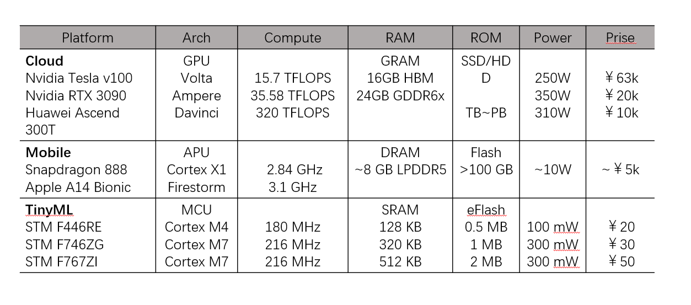

# uAISS

一个嵌入式上的神经网络推理软件栈。

简中|[EN](Readme.md)

tinyML 推理堆栈。

本文档包含 tinyML 的介绍和概述。

名称解释[here](doc/nameIDEA.md)。

## 介绍

将 AI（人工智能）迁移到嵌入式应用程序可能会带来一些挑战。与云计算和移动计算相比，嵌入式硬件的生态系统是碎片化的，无论是从软件到硬件，从构建系统到编译器，还是从指令集到外围设备。嵌入式系统是一种针对应用高度定制化的计算机系统，从而导致了高度定制化的软硬件设计。OS（操作系统）从裸机到 RTOS（实时操作系统），再到微内核，再到 Linux(GPOS)，旨在适应不同的硬件与应用需求。功耗可以从微瓦到数百瓦不等，以适应从传感器分析到自动驾驶汽车和无人机的需求。典型的嵌入式系统具有以下特征：

有限的计算资源：AI/ML 算法通常需要更多的计算。运行程序需要 CPU（中央计算单元）时间和 RAM（随机访问内存）。它们通常与平台的功耗成正比。在将 AI 算法移植到边缘时，这将带来重大挑战。如下表所示，通过Cloud Mobile和Tiny对比，可以很明显的看出计算能力的差异。

碎片化的生态系统：内存的容量可以从千字节到兆字节，从 SRAM 到 SDRAM 再到 DRAM。核心标志Tm值分数从几十到几千不等。SIMD 和浮点运算也仅限于特定的硬件平台。HAL（硬件抽象层）也可以不同以适应应用场景。

缺乏广泛接受的基准测试：来自不同硬件供应商的处理器具有不同的调试接口、简单的操作系统或裸机。用户应用程序和操作系统的代码通常混合在一起。除了缺少文件系统和 shell 接口之外，在单个应用程序上运行基准测试变得更加困难。

缺乏可移植性：用于商业用途的软件堆栈始终面向业务逻辑。为了速度和空间而牺牲了可移植性。

人工智能作为一个广义的术语，是指展示人类智能的机器。最近，最直接的方法是通过神经网络。但是神经网络本身通常是无法解释的，需要在大型数据集上进行训练或验证。为嵌入式硬件设计算法尤其具有挑战性：

缺乏成熟的用例：从学术和商业角度来说，深度学习的大多数进步都是针对移动平台的云。
缺乏开放数据集：截至 2021 年，大多数开源数据集都是为云使用而设计的。
缺乏成熟的模型架构：嵌入式设备没有被广泛接受的模型架构。大多数成熟的神经网络架构都是为云计算而设计的，每次推理可能需要高达 25 G-FLOPS。如下图所示，图像是从 MLPerf 中裁剪出来的Tm值.
缺乏高效和可移植的模型格式：目前 TinyML 最常用的模型格式是 ONNX 和 tflite。但它们中的任何一个都是专为嵌入式设备设计的。ONNX 旨在成为训练框架之间的通用格式。TfLite 旨在在移动设备上运行。ONNX 很复杂，很难涵盖实现中的所有操作。解码 tflite 模型需要强大的计算能力。

tinyML 组织给出的 TinyML 的定义是

微型机器学习被广泛定义为一个快速发展的机器学习技术和应用领域，包括硬件、算法和软件，能够以极低的功率执行设备上的传感器数据分析，通常在 mW 范围及以下，从而实现各种始终在线的用例和针对电池供电的设备。

据我们所知，TinyML 的定义可以量化为：

始终开启的功耗：< 1 mW
需要的内存：< 100 KB
所需 ROM：< 1 MB
操作计数：< 10 MMAC / Inf
延迟：< 100 毫秒/Inf
设计 TinyML 应用程序将面临来自各个方面的挑战。一方面，人工智能算法需要巨大的计算能力。另一方面，嵌入式生态系统是碎片化的，嵌入式设备的计算能力有限。

由于供应问题或技术进步，承担 TinyML 工作负载的处理器需要定期更换。当这种情况不可避免地发生时，推理解决方案也需要移植。

需要一个必要的工具来简化从训练框架部署模型的过程。并使这个过程自动化。

优化框架时

尽管如此，TinyML 的成熟可以为商业工业和消费产品带来一定的好处。包括

更多用户隐私：大多数终端用户越来越关心隐私，不想与第三方云解决方案提供商共享个人数据。通过在边缘本地处理感官数据，可以大大提高客户感知价值。

降低云计算成本：在云上执行时，随着边缘节点数量的增长，公司可以轻松烧掉数万美元。通过对边缘传感器进行推理，可以降低 PaaS 或 IaaS 平台的不可靠性和高成本。

更高的可靠性：2012 年平安夜，AWS 故障导致 Netflix 停机。2020 年底，谷歌云故障导致一些基本的谷歌服务宕机。云计算并不像它声称的那样可靠。通过在边缘执行推理，您可以轻松维护边缘节点并减少停机时间。

低延迟：通过在边缘直接分析香炉数据，配合足够优化的硬件软件和算法，可以减少延迟，进一步提高客户感知价值。

TinyML 推理解决方案
Tensorflow Lite Micro
待定

微型TVM
待定

辉光
待定

引擎
待定

我们的解决方案
在我们的设计过程中，我们考虑了一些基本问题以及如何解决它们：

提供可轻松移植和自动部署的便携且灵活的平台。
最大限度地减少对外围设备和硬件要求的依赖。
方便硬件开发者优化运维瓶颈。
支持广泛的人工智能生态系统，包括支持操作和模型格式与训练框架，使其易于部署和实现。
支持流行的量化方案和网络压缩方法。带来最小的准确度扣除。降低每次推理的操作次数并减少延迟。
考虑到解决这些问题，我们为 SA 进行了顶层设计。SA 采用 tflite 格式的模型文件。然后解析并编译成 IR（中间表示）。然后经过两层优化，与硬件无关的算法优化和特定于硬件的优化。最终目标是完全用 C 生成的计算图，并与 C99 标准兼容。

为了最大限度地减少碎片化内存堆空间的不稳定影响，系统提供了 First-Fit 算法。在编译期间，使用模拟过程来确定所需的内存大小。然后使用静态分配的数组分配“操场”，因为为了可移植性，我们假设不支持动态分配。在运行时，SA 使用 First-Fit 在“操场”中自动分配空间。虽然 First-Fit 可以产生记忆片段，但是在一个推理循环之后所有的片段都会被召回。

SA 分为前端和后端两部分。前端主要是用 Python3 编写的。Frontend 包含模型接口，目前仅支持 flatbuffer 格式的 tflite 模型，因为 TFLM 现在是 tinyML 推理框架的事实。作为训练框架的接口，我们使用flatc将TensorFlow Lite提供的schema文件编译成python接口来解析模型。只要模型是 tflite 格式，就可以用 TensorFlow 或 Keras 训练，并且只使用支持的操作，SA 可以解析模型。下图是 flatbuffer 格式的 tflite 模型的可视化类图。

前端还包括一个虚拟的 First-Fit runner 来确定堆大小。前端有两种类，转换器和IR。IR 使用存在于其自身层中的信息来生成一些外部表示，例如作为图形的 C 文件或用于可视化的点图。每个 IR 仅用于一个目的，例如计算 DAG（有向无环图）的拓扑顺序或生成点图。有一个 IR 是统一的并且拥有最多的信息，所有其他 IR 都是从这个统一的 IR 与特定的转换器转换而来。为简单起见，一些转换器被集成到类构造函数中。顾名思义，转换器从一个源 IR 获取信息并将信息填充到另一个目标 IR。

下图是 Resnet-10 的简化点图。该模型是MLPerf的图像分类模型Tm值 微小的封闭分裂。

后端是运算符和堆算法的实际实现。运算符和图形接口以及堆分配的标准文档将很快添加。

基准测试结果
在这里，我们展示了 2 个基准测试结果。一个是图像分类任务，直接比较TFLM（TensorFlow Lite Micro）和SA之间相同的神经网络。另一个是成熟的基准套装。

延迟比较
我们设计了一个包含所有基本操作的简单网络，包括 2D 卷积、2D Max 池化、ReLu 激活、Full Connect 和 softmax。完整的网络可以在下图中看到。

网络输入是来自 MNIST 的 28x28 图像，输出是单热编码向量。在实现RV32 IMACF、GCC 8.3.0编译、优化级别2、300MHz运行的RISC-V MCU上，TFLM和SA空间和速度的直接比较见下表。

以 KB 为单位的数据大小	以 KB 为单位的代码大小	以毫秒为单位的延迟
TFLM	130.3	296.3	14.6
萨	19.1	20.1	7.0
与 TFLM 相比，RAM 使用量减少了 93.2%。ROM 使用量减少了 86.2%。延迟减少了 52.1%。

在相同的硬件、相同的编译器选项、相同的网络架构上，通过简单地从 TFLM 更改为 SA，可以减少空间并提高速度。在相同的硬件上，通过使用 SA 而不是 TFLM，可以实现更强大的网络，否则会耗尽内存或导致运行时间过长。

MLPerfTm值 微小的推理
MLPerfTm值 Tiny 由 MLCommons 在社区成员的帮助下开发和发布。

我们 (MLCommons) 推出了 MLPerf Tiny，这是第一个用于超低功耗微型机器学习系统的行业标准基准测试套件。

随着 TinyML 技术的最新进展以及嵌入式生态系统的极度分散，需要一个广泛接受的基准测试套件来量化芯片的 AI 计算能力，无论是异构还是其他。MLPerfTm值Tiny 是第一个发布的专为 TinyML 设计的基准套件。对于第一轮 MLPerfTm值Tiny，有四个提交者，他们都使用不同的硬件来承担负载，一个RISC-V微控制器，一个ASIC，一个Cortex-A ARM处理器，一个FPGA，参考系统是一个Cortex-M微控制器。第一次提交完美地展示了嵌入式生态系统的碎片化以及专门为 TinyML 设计基准套件时面临的挑战。

作为概念证明，我们的团队参加了这一轮 MLPerf Tiny，我们在那里展示了 RISC-V 微控制器的人工智能计算能力和人工智能中的潜在应用。
作为提交者和审查者，我们与哈佛和 EEMBC 等相关方密切合作，提交了 RISC-V MCU 条目。在本次提交期间，我们使用了定制设计的硅解决方案，通过 FPU 实现了 RV32I MAC 指令集，以支持单精度浮点运算。该SoC由PCL设计，采用中芯国际（Semiconductor Manufacturing International Corporation）55nm工艺制造，可在300MHz以上的时钟速度下运行。具有 2MB SRAM 和大量接口，包括 SPI I2C UART GPIO 和 CAN 总线。
测试套件中有四个测试用例，涵盖了截至 2021 年 TinyML 最完善的用例、图像分类、音频唤醒词、视觉唤醒词和异常检测。异常检测使用深度自动编码器来检测音频中的异常。神经网络本质上采用 FFT 编码的音频频谱并输出另一个频谱。通过比较输入和输出之间的距离，量化了网络对输入音频进行编码和解码的能力。由于自动编码器仅使用来自玩具车的普通音频数据进行训练，如果输入和输出的距离大于给定阈值，则神经网络缺乏对给定音频频谱进行编码-解码的能力。然后我们假设音频来自异常的玩具车。使用经典 ResNet 结构的任务图像分类。通过使用残差块来简化训练过程。ResNet 是一种更实际的用于图像分类任务的神经网络结构。关键词定位（音频唤醒词）和视觉唤醒词均采用DS-CNN网络架构，采用移动网络启发的网络块。音频唤醒词通过对输入频谱进行分类来识别音频数据流中的特定关键字，并输出一个热编码向量。视觉唤醒词采用预处理图像并输出一个表示人或非人的热向量。音频唤醒词通过对输入频谱进行分类来识别音频数据流中的特定关键字，并输出一个热编码向量。视觉唤醒词采用预处理图像并输出一个表示人或非人的热向量。音频唤醒词通过对输入频谱进行分类来识别音频数据流中的特定关键字，并输出一个热编码向量。视觉唤醒词采用预处理图像并输出一个表示人或非人的热向量。

在测试服方面，一个封闭源代码的基准运行程序在主机上运行，​​为每个提交者生成一个可比较的和票价结果。运行器使用基于文本的协议通过 UART 与主机通信，然后使用设备的内部计时器测量推理延迟。

我们的团队为所有 4 个测试用例开发了固件，以进行更彻底的比较。我们修改了 TensorFlow Lite Micro 2.3.1 并在 RISC-V GCC 10.2.0 上编译。我们系统的所有代码/结果将在发布后在 GitHub 上开源。

您可以从 MLCommons 查看已发布的结果。论文和新闻报道链接将在 2021 年 6 月 15 日之后更新。

初步结果
免责声明：参考提交是由 MLCommons 开发的。RISC-V 结果由我们提供。但是这个结果仍然受到 MLCommons 的限制。此处显示的结果仅用于早期炫耀，仅供内部使用。所有相关方均不保证此结果的正确性。

上表中的延迟数据以毫秒为单位。

路线图和未来
顾名思义，SA 处于原型设计阶段。需要制定未来的路线图。

支持量化和模型压缩。
更多运营支持
支持PIC和运行时分配，允许动态导入模型图
支持 FPGA
支持更优化的堆分配算法和内存计划以降低空间消耗
开发商

	徐学松	牛文旭
电子邮件	xuxs@pcl.ac.cn	wniu@connect.ust.hk
GitHub	https://github.com/coolbacon	https://github.com/ninn55
我想贡献或有任何建议，请通过电子邮件与我们联系。

致谢
最初，该项目是在鹏程实验室和吉德操作系统有限公司的支持下开发的。

鹏程实验室	积德操作系统
个人电脑	吉德奥斯
参考
https://www.tinyml.org/
https://arxiv.org/pdf/2010.08678.pdf
https://arxiv.org/pdf/2003.04821.pdf
